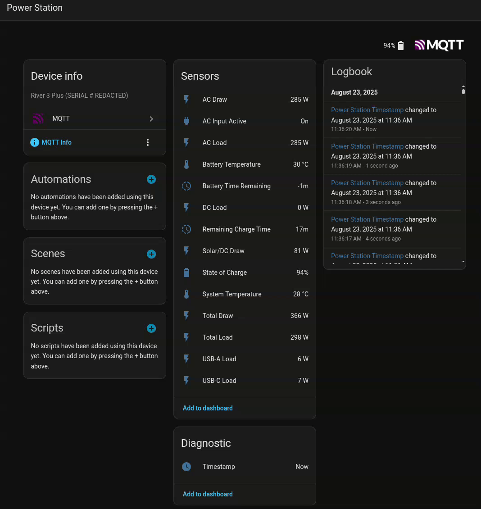

# r3pcomms
Local communication with a River 3 Plus over USB HID and/or CDC(ACM)

[](https://asciinema.org/a/722902)

## Usage
```
$ python -m r3pcomms --help
usage: python -m r3pcomms [-h] [--version] [--debug] [--identify]
                          [--redact-serial] [--serial SERIAL] [--hid [HID]]
                          [--number NUMBER] [--every EVERY] [--humanize]

Local communication with a River 3 Plus over USB HID and/or CDC(ACM)

options:
  -h, --help            show this help message and exit
  --version, -V         show program's version number and exit
  --debug, -d           print raw comms messages
  --identify, -i        get unit's serial number (must specify --serial)
  --redact-serial, -r   redact serial number from all prints
  --serial SERIAL, -s SERIAL
                        poll for data via serial comms using this port; eg.
                        "COM3" or "/dev/ttyACM0" or "/dev/serial/by-id/usb-
                        EcoFlow_EF-UPS-RIVER_3_Plus_${SERIALNUMBER}-if01"
  --hid [HID]           poll for data via HID comms. optinally specify a
                        VENDOR_ID:PRODUCT_ID to use instead of 3746:ffff
  --number NUMBER, -n NUMBER
                        poll for data this many times (0 means forever)
  --every EVERY, -e EVERY
                        data poll period in seconds
  --humanize            output formatted for humans, otherwise json for the
                        robots
```
For USB device permissions issues, see: https://github.com/pyusb/pyusb/blob/master/docs/faq.rst#how-to-practically-deal-with-permission-issues-on-linux  
My River 3 Plus has a USB `vendorID:productID` of `3746:ffff`

### Integration with Home Assistant
The Arch package installs a script, [homeassistant-mqtt-publisher.sh](scripts/homeassistant-mqtt-publisher.sh), to export the power station's monitored parameters to Home Assistant via MQTT. You can either edit it to uncomment three environment variables and redefine them for your setup or export them in the environment you run the script in:
```bash
export MQTTUI_BROKER="mqtt://192.168.1.1:1883"
export MQTTUI_USERNAME="homeassistant"
export MQTTUI_PASSWORD="your hass mqtt password here"
```
After running the script, and after [you've added the proper entites as MQTT sensors](https://www.home-assistant.io/integrations/mqtt/#configuration)[1], Home Assistant can now log and display all of the power station's parameters.

New data will appear about once per second in Home Assistant's MQTT Broker topic `r3pcomms/DEVICESERIALNUMBER` with the following json format following that shown in the command line usage examples in the next secion.

\[1]: Here's my Home Assistant MQTT [configuration.yaml](doc/configuration.yaml) to help you get started.




#### Sensors/Entities working so far in Home Assistant
You can log/view the values for the following items with roughly one second time resolution
Entity Name | Unit | Notes
------------|------|------
AC Draw|Watts|
AC Input Active|Boolean|
AC Load|Watts|
Battery Temperature|Degrees Celcius|
Battery Time Remaining|Minutes|`-1` when the battery is not discharging
DC Load|Watts|
Remaining Charge Time|Minutes|`-1` when the battery is not charging up
Solar/DC Draw|Watts|
State of Charge|Percentage|
System Temperature|Degrees Celcius|
Total Draw|Watts|
Total Load|Watts|
USB-A Load|Watts|
USB-C Load|Watts|

### Command Line Examples
In linux, using serial + HID comms, output formatted for humans:
```
$ python -m r3pcomms --serial /dev/ttyACM0 --hid --redact-serial --humanize
Iteration:      1
Run Time:       0.1s
Delta Time:     nans
Unix Time:      1755972571.0s
Version:        3.1.3
Design Charge Capacity: 12800mAh
Temperatures:   (30, 32, 25, 25)degC
Total Load:     292.0W
Total Draw:     83.8W
AC Draw:        0.0W
Solar/DC Draw:  83.8W
AC Load:        281.5W
DC Load:        0.0W
USB-A Load:     6.1W
USB-C Load:     4.4W
Serial Num:     REDACTED
Remaining Charge Time:  -1min
Charge Level:   85%
Battery Time Remaining: (64,)min
Flags:  0b0000111000000000
AC In Live:     True
```
in Windows using com port:
```
$ python -m r3pcomms --serial COM3 --identify --redact-serial
[{"name": "Serial Num", "type": "s22", "data": "0xffffffffffffffffffffffffffffffff", "value": "REDACTED", "unit": ""}]
```
in Linux using serial port:
```
$ python -m r3pcomms --serial /dev/ttyACM0 --identify --redact-serial
{"Serial Num": {"type": "s22", "data": "0xffffffffffffffffffffffffffffffff", "value": "REDACTED", "unit": ""}}
$ python -m r3pcomms --serial /dev/ttyACM0 --identify --redact-serial | jq -r '.["Serial Num"]["value"]'
REDACTED
```
using HID (only tested in linux):
```
$ python -m r3pcomms --hid
{"Charge Level": {"type": "h12", "data": "0x0c4c", "value": 76, "unit": "%"}}
```
fetch _only_ the state of charge:
```
$ python -m r3pcomms --hid | jq '.["Charge Level"]["value"]'
75
```
with debugging,  
`>s>` indicates a serial data transmit  
`<s<` indicates a serial data reception  
`<x<` indicates the previous data reception after deobfuscation  
`>h>` indicates a USB HID data transmit  
`<h<` indicates a USB HID data reception:  
```
$ python -m r3pcomms --serial /dev/ttyACM0 --hid --number 3 --redact-serial --debug
 -m r3pcomms --serial /dev/ttyACM0 --hid --number 3 --redact-serial --debug
>s> aa030000de2d00000000ffff22020101660286ef
<s< aa03b800392f0000000001440222010166020101000002000400000000030004003200000400041a1c1919050004000000000600040000000007000454628143080004b7a1e941090004000000000a0004000000000b0004000000000c0004b7a1e9410d0004580200000e0004546281c30f00043c000000100004000000001100040000000012000400000000130004000000001400040000000015000400000000160010ffffffffffffffffffffffffffffffff170004331700001800040000000019000423010002211e
<x< aa03b800392f0000000001440222010166020101000002000400000000030004003200000400041a1c1919050004000000000600040000000007000454628143080004b7a1e941090004000000000a0004000000000b0004000000000c0004b7a1e9410d0004580200000e0004546281c30f00043c000000100004000000001100040000000012000400000000130004000000001400040000000015000400000000160010ffffffffffffffffffffffffffffffff170004331700001800040000000019000423010002
>h> a101030c0010
<h< 0c4c
{"unknown-s": {"type": "s2", "data": "0x00000000", "value": 0.0, "unit": "?"}, "Design Capacity?": {"type": "s3", "data": "0x00320000", "value": 12800, "unit": "?"}, "Capacity?/Battery Voltage?": {"type": "s4", "data": "0x1a1c1919", "value": [7194, 6425], "unit": "?"}, "unknown-s0": {"type": "s5", "data": "0x00000000", "value": 0.0, "unit": "?"}, "unknown-s1": {"type": "s6", "data": "0x00000000", "value": 0.0, "unit": "?"}, "Total Load": {"type": "s7", "data": "0x54628143", "value": 258.7681884765625, "unit": "W"}, "Total Draw": {"type": "s8", "data": "0xb7a1e941", "value": 29.203962326049805, "unit": "W"}, "AC Draw": {"type": "s9", "data": "0x00000000", "value": 0.0, "unit": "W"}, "AC Draw Frequency?": {"type": "s10", "data": "0x00000000", "value": [0, 0], "unit": "Hz"}, "unknown-s2": {"type": "s11", "data": "0x00000000", "value": 0.0, "unit": "?"}, "Solar/DC Draw": {"type": "s12", "data": "0xb7a1e941", "value": 29.203962326049805, "unit": "W"}, "unknown-s3": {"type": "s13", "data": "0x58020000", "value": 8.407790785948902e-43, "unit": "?"}, "AC Load": {"type": "s14", "data": "0x546281c3", "value": 258.7681884765625, "unit": "W"}, "AC Load Frequency?": {"type": "s15", "data": "0x3c000000", "value": [60, 0], "unit": "Hz"}, "DC Load": {"type": "s16", "data": "0x00000000", "value": -0.0, "unit": "W"}, "USB-A Load": {"type": "s17", "data": "0x00000000", "value": -0.0, "unit": "W"}, "USB-C Load": {"type": "s18", "data": "0x00000000", "value": -0.0, "unit": "W"}, "unknown-s4": {"type": "s19", "data": "0x00000000", "value": 0.0, "unit": "?"}, "unknown-s5": {"type": "s20", "data": "0x00000000", "value": 0.0, "unit": "?"}, "unknown-s6": {"type": "s21", "data": "0x00000000", "value": 0.0, "unit": "?"}, "Serial Num": {"type": "s22", "data": "0xffffffffffffffffffffffffffffffff", "value": "REDACTED", "unit": ""}, "Time left?": {"type": "s23", "data": "0x33170000", "value": [98.98333333333333, 0.0], "unit": "Hr?"}, "unknown-s7": {"type": "s24", "data": "0x00000000", "value": 0.0, "unit": "?"}, "unknown-s8": {"type": "s25", "data": "0x23010002", "value": 9.404281028860795e-38, "unit": "?"}, "preamble?": {"type": "pre", "data": "aa03b800392f00000000014402220101660201010000", "value": 0, "unit": ""}, "Charge Level": {"type": "h12", "data": "0x0c4c", "value": 76, "unit": "%"}}
>s> aa030000de2d01000000ffff2202010166027b2c
<s< aa03b800392f0100000001440222010166020000010103010501010101020105013301010501051b1d18180401050101010107010501010101060105ff856742090105c7d5eb40080105010101010b0105010101010a0105010101010d0105c7d5eb400c0105590301010f0105ff8567c20e01053d010101110105010101011001050101010113010501010101120105010101011501050101010114010501010101170111ffffffffffffffffffffffffffffffff16010532160101190105010101011801052200010364db
<x< aa03b800392f0100000001440222010166020101000002000400000000030004003200000400041a1c19190500040000000006000400000000070004fe846643080004c6d4ea41090004000000000a0004000000000b0004000000000c0004c6d4ea410d0004580200000e0004fe8466c30f00043c000000100004000000001100040000000012000400000000130004000000001400040000000015000400000000160010ffffffffffffffffffffffffffffffff170004331700001800040000000019000423010002
>h> a101030c0010
<h< 0c4c
{"unknown-s": {"type": "s2", "data": "0x00000000", "value": 0.0, "unit": "?"}, "Design Capacity?": {"type": "s3", "data": "0x00320000", "value": 12800, "unit": "?"}, "Capacity?/Battery Voltage?": {"type": "s4", "data": "0x1a1c1919", "value": [7194, 6425], "unit": "?"}, "unknown-s0": {"type": "s5", "data": "0x00000000", "value": 0.0, "unit": "?"}, "unknown-s1": {"type": "s6", "data": "0x00000000", "value": 0.0, "unit": "?"}, "Total Load": {"type": "s7", "data": "0xfe846643", "value": 230.51950073242188, "unit": "W"}, "Total Draw": {"type": "s8", "data": "0xc6d4ea41", "value": 29.353893280029297, "unit": "W"}, "AC Draw": {"type": "s9", "data": "0x00000000", "value": 0.0, "unit": "W"}, "AC Draw Frequency?": {"type": "s10", "data": "0x00000000", "value": [0, 0], "unit": "Hz"}, "unknown-s2": {"type": "s11", "data": "0x00000000", "value": 0.0, "unit": "?"}, "Solar/DC Draw": {"type": "s12", "data": "0xc6d4ea41", "value": 29.353893280029297, "unit": "W"}, "unknown-s3": {"type": "s13", "data": "0x58020000", "value": 8.407790785948902e-43, "unit": "?"}, "AC Load": {"type": "s14", "data": "0xfe8466c3", "value": 230.51950073242188, "unit": "W"}, "AC Load Frequency?": {"type": "s15", "data": "0x3c000000", "value": [60, 0], "unit": "Hz"}, "DC Load": {"type": "s16", "data": "0x00000000", "value": -0.0, "unit": "W"}, "USB-A Load": {"type": "s17", "data": "0x00000000", "value": -0.0, "unit": "W"}, "USB-C Load": {"type": "s18", "data": "0x00000000", "value": -0.0, "unit": "W"}, "unknown-s4": {"type": "s19", "data": "0x00000000", "value": 0.0, "unit": "?"}, "unknown-s5": {"type": "s20", "data": "0x00000000", "value": 0.0, "unit": "?"}, "unknown-s6": {"type": "s21", "data": "0x00000000", "value": 0.0, "unit": "?"}, "Serial Num": {"type": "s22", "data": "0xffffffffffffffffffffffffffffffff", "value": "REDACTED", "unit": ""}, "Time left?": {"type": "s23", "data": "0x33170000", "value": [98.98333333333333, 0.0], "unit": "Hr?"}, "unknown-s7": {"type": "s24", "data": "0x00000000", "value": 0.0, "unit": "?"}, "unknown-s8": {"type": "s25", "data": "0x23010002", "value": 9.404281028860795e-38, "unit": "?"}, "preamble?": {"type": "pre", "data": "aa03b800392f01000000014402220101660201010000", "value": 0, "unit": ""}, "Charge Level": {"type": "h12", "data": "0x0c4c", "value": 76, "unit": "%"}}
>s> aa030000de2d02000000ffff2202010166027f28
<s< aa03b800392f020000000144022201016602030302020002060202020201020602300202060206181e1b1b07020602020202040206020202020502061b8764410a0206580fe9430b02060202020208020602020202090206020202020e0206580fe9430f02065a0002020c02061b8764c10d02063e020202120206020202021302060202020210020602020202110206020202021602060202020217020602020202140212ffffffffffffffffffffffffffffffff150206311502021a0206020202021b020621030200c72b
<x< aa03b800392f0200000001440222010166020101000002000400000000030004003200000400041a1c19190500040000000006000400000000070004198566430800045a0deb41090004000000000a0004000000000b0004000000000c00045a0deb410d0004580200000e0004198566c30f00043c000000100004000000001100040000000012000400000000130004000000001400040000000015000400000000160010ffffffffffffffffffffffffffffffff170004331700001800040000000019000423010002
>h> a101030c0010
<h< 0c4c
{"unknown-s": {"type": "s2", "data": "0x00000000", "value": 0.0, "unit": "?"}, "Design Capacity?": {"type": "s3", "data": "0x00320000", "value": 12800, "unit": "?"}, "Capacity?/Battery Voltage?": {"type": "s4", "data": "0x1a1c1919", "value": [7194, 6425], "unit": "?"}, "unknown-s0": {"type": "s5", "data": "0x00000000", "value": 0.0, "unit": "?"}, "unknown-s1": {"type": "s6", "data": "0x00000000", "value": 0.0, "unit": "?"}, "Total Load": {"type": "s7", "data": "0x19856643", "value": 230.51991271972656, "unit": "W"}, "Total Draw": {"type": "s8", "data": "0x5a0deb41", "value": 29.381519317626953, "unit": "W"}, "AC Draw": {"type": "s9", "data": "0x00000000", "value": 0.0, "unit": "W"}, "AC Draw Frequency?": {"type": "s10", "data": "0x00000000", "value": [0, 0], "unit": "Hz"}, "unknown-s2": {"type": "s11", "data": "0x00000000", "value": 0.0, "unit": "?"}, "Solar/DC Draw": {"type": "s12", "data": "0x5a0deb41", "value": 29.381519317626953, "unit": "W"}, "unknown-s3": {"type": "s13", "data": "0x58020000", "value": 8.407790785948902e-43, "unit": "?"}, "AC Load": {"type": "s14", "data": "0x198566c3", "value": 230.51991271972656, "unit": "W"}, "AC Load Frequency?": {"type": "s15", "data": "0x3c000000", "value": [60, 0], "unit": "Hz"}, "DC Load": {"type": "s16", "data": "0x00000000", "value": -0.0, "unit": "W"}, "USB-A Load": {"type": "s17", "data": "0x00000000", "value": -0.0, "unit": "W"}, "USB-C Load": {"type": "s18", "data": "0x00000000", "value": -0.0, "unit": "W"}, "unknown-s4": {"type": "s19", "data": "0x00000000", "value": 0.0, "unit": "?"}, "unknown-s5": {"type": "s20", "data": "0x00000000", "value": 0.0, "unit": "?"}, "unknown-s6": {"type": "s21", "data": "0x00000000", "value": 0.0, "unit": "?"}, "Serial Num": {"type": "s22", "data": "0xffffffffffffffffffffffffffffffff", "value": "REDACTED", "unit": ""}, "Time left?": {"type": "s23", "data": "0x33170000", "value": [98.98333333333333, 0.0], "unit": "Hr?"}, "unknown-s7": {"type": "s24", "data": "0x00000000", "value": 0.0, "unit": "?"}, "unknown-s8": {"type": "s25", "data": "0x23010002", "value": 9.404281028860795e-38, "unit": "?"}, "preamble?": {"type": "pre", "data": "aa03b800392f02000000014402220101660201010000", "value": 0, "unit": ""}, "Charge Level": {"type": "h12", "data": "0x0c4c", "value": 76, "unit": "%"}}
```

## Installation
### From the Arch User Repository via paru
https://aur.archlinux.org/packages/python-r3pcomms-git
```
$ paru -Syu python-r3pcomms-git
```
Using this package should take care of any possible permissions issues if you add your user to the `efusb` and `uucp` groups, then reboot.
## An untested system shutdown script
This script is meant to monitor the power bank's state of charge and power off the computer when the charge level drops below 10%  
[ups-poweroff.sh](scripts/ups-poweroff.sh)  

Call it once with a `forever` argument and let it periodically check the state of charge like:
```
$ ./ups-poweroff.sh forever
```  
or you could schedule calls yourself every minute by adding a line like this to your crontab:
```
* * * * * /usr/bin/ups-poweroff.sh
```
